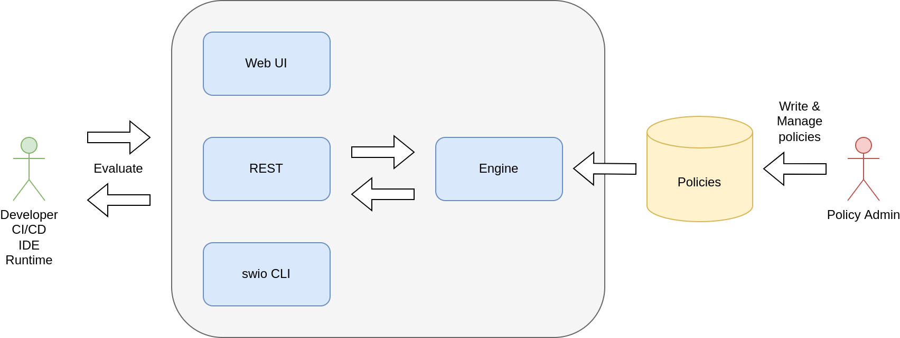

# Seedwing Policy

[](https://github.com/seedwing-io/seedwing-policy/actions?query=workflow%3A%22CI%22)
[](https://crates.io/crates/seedwing-policy-engine)
[](https://docs.rs/seedwing-policy-engine)

A functional type system for implementing policy inspection, audit and enforcement.

Seedwing Policy consists of components that may be combined or used standalone as part of a secure software supply chain:

* *Dogma* - a policy description language.
* *Engine* - a policy evaluation engine.



With Seedwing Policy, you can:

* Validate, destructure and inspect payload according to standards like CycloneDX, SPDX, OpenVEX, PEM and more.
* Check for permitted licenses according to organization policy.
* Check for trusted signatures against [Sigstore](https://sigstore.dev).
* Check SBOM dependencies for vulnerabilities against [OSV](https://osv.dev).

Additionally, Seedwing provides detailed explanations of the decision process.

The Seedwing engine includes _core patterns_ to assist in policy authoring.

Some examples include:

* Sigstore
* x509
* CycloneDX
* OpenVEX
* SPDX
* Maven
* Base64

All the policies can be centrally managed in a server, or built in as part of a custom application.

Seedwing Policy is primarily concerned with software supply chain, but may be used in other contexts as well such as authorization policies for Apache Kafka.

See the [documentation](https://docs.seedwing.io/docs/index.html) for more information.

## Usage

To use the policy engine, download the [latest released](https://github.com/seedwing-io/seedwing-policy/releases/latest) `swio` binary for your platform, or use one of container images.

You can also try a hosted version at [https://playground.seedwing.io](https://playground.seedwing.io).

To evaluate policies:

```ignore
swio eval -p <policy dir> -n mypolicy::pattern -i input.json
```

To run the HTTP server (point your browser to the http://localhost:8080 to view the console):

```ignore
swio serve -p <policy dir>
```

To benchmark policies:

```ignore
swio bench -p <policy dir> -n mypolicy::pattern -i input.json -c 1000
```

## Minimum supported Rust version (MSRV)

Seedwing Policy is guaranteed to compile on the latest stable Rust version at the time of release. It might compile with older versions.

## Development setup

See [CONTRIBUTING.md](CONTRIBUTING.md#setup)

## License

Apache License, Version 2.0 ([LICENSE](LICENSE))
