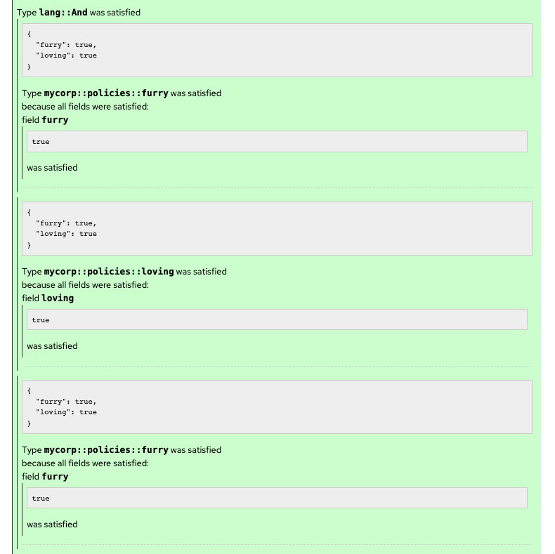

== Seedwing

`Seedwing-Policy` is a type/pattern/function-based _policy engine_ which can be embedded in another process, or accessed over REST APIs. The general idea of a policy engine is that a consumer requiring a decision presents the information they have available, and the policy engine inspects the information, possibly transforming or augmenting it, to provide a decision as to if the inputs represent compliance or violation of the policy.

Seedwing Policy consists of several components that may be combined or used standalone:

* *Dogma* - a policy language.
* *Engine* - a policy evaluation engine.
* *Server* - an HTTP server and API for evaluating policies.

With Seedwing, you can:

* Validate, destructure and inspect payload according to standards like CycloneDX, SPDX, OpenVEX, PEM and more.
* Check for permitted licenses according to organization policy.
* Check for trusted signatures against link:https://sigstore.dev)[Sigstore].
* Check SBOM dependencies for vulnerabilities against link:https://osv.dev[OSV].

Additionally, Seedwing provides detailed explanations of the decision process.




The Seedwing engine includes link:/policy/[core patterns] to assist in policy authoring.
Some examples include:

* link:/policy/sigstore[Sigstore]
* link:/policy/x509[x509]
* link:/policy/cyclonedx[CycloneDX]
* link:/policy/spdx[SPDX]
* link:/policy/maven[Maven]
* link:/policy/base64[Base64]

There is also a link:faq/[FAQ].

=== Dogma Policy Language

Policies are defined in terms of _patterns_ which match input value types.
Generally the inputs may be JSON or other handy serialized formats.
The patterns are defined in a format-agnostic way using the _Dogma_ policy language.

For more information about the *Dogma* policy language, please reference to the link:dogma/[Dogma Language Reference].

=== Engine

The core policy engine is simply a Rust library, which can be embedded or used by other processes as needed.
The engine includes the parsing and compiling of the Dogma language into executable policies.

```rust
let result = world.evaluate( policy_path, input_value, EvalContext::default() ).await;
```

=== CLI

the link:cli/[Seedwing CLI] directly embeds the engine and provides command-line access to its functionality.
Consumers can evaluate input data against policies by providing files or streams on `STDIN`.

=== Server

The link:server/[Seedwing Policy Server] embeds the engine and provides a REST endpoint for every suitable policy.
Consumers may simply POST JSON to a given policy's endpoint and receive a decision via HTTP response codes.

==== Experimentation

The server includes a human-friendly user-interface to access each suitable policy also.
This includes the documentation and definition of the policy, linking to other policies where applicable.
Additionally, example experimental data may be submitted through a form to interactively experiment with a given policy and understand the explanation provided.

==== Playground

An link:/playground[interactive playground] is also provided by the server for working with parameterized policies or learning useful policy patterns.
